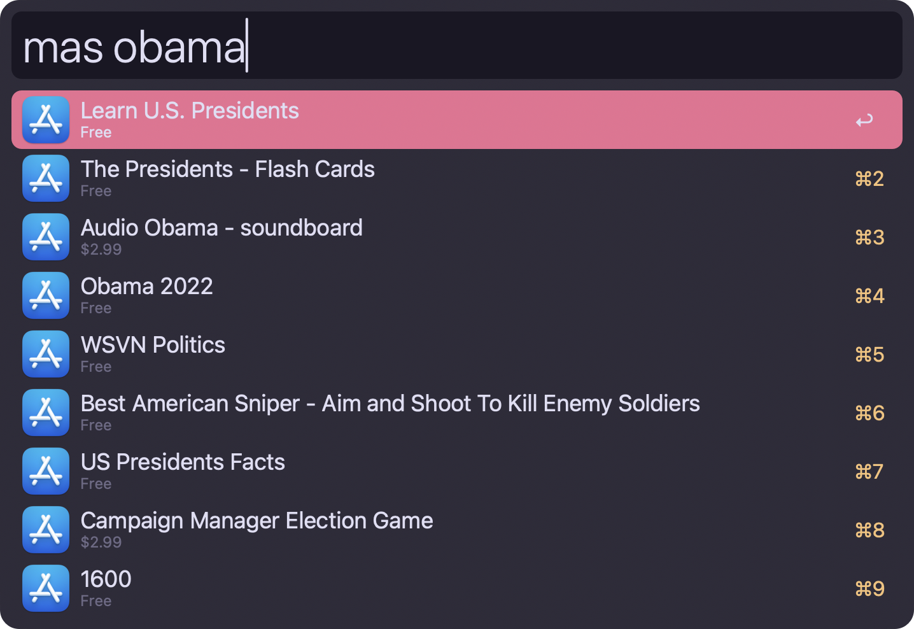

# App Store Search Alfred Workflow

Search the Mac App Store directly from Alfred using the `mas` CLI.

## Setup

1. Install the `mas` command-line tool (requires Homebrew):  
   ```shell
   brew install mas
   ```
2. (Optional) In Alfred’s workflow configuration, set your preferred keyword (default: `mas`).

## Usage

Type your keyword followed by a search term:




• <kbd>↩︎</kbd> Open the selected app in the Mac App Store.  
• <kbd>⌘</kbd><kbd>C</kbd> Copy the App ID to the clipboard.  
• <kbd>⌘</kbd>+R Refresh results on demand.

Results are cached for 24 hours by default (cache lifetime configured in `search-app-store.swift`). Press <kbd>⌘</kbd>+R in Alfred to force an immediate refresh.

## Configuration

• **Search Keyword** (`KEYWORD`): the Alfred trigger for searches (default `mas`).  
  – Required, trimmed.  

## Troubleshooting

• Ensure you’re signed in to the Mac App Store and that `mas` is correctly installed (`mas version`).  
• For bugs or feature requests, please open an issue on GitHub:  
  https://github.com/philocalyst/alfred-app-store-search/issues
